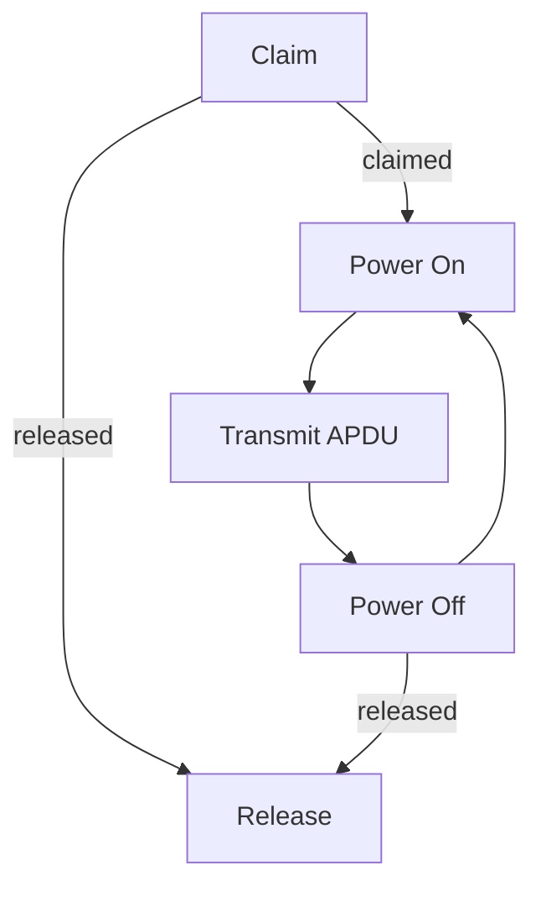

# NotCCID Protocol Design

The NotCCID communication protocol is only available for [ESTKme-RED] product.

[ESTKme-RED]: https://www.estk.me/product/estkme-red/

## Protocol format

### Packet Format

| Offset | Field                | Type                 |
| ------ | -------------------- | -------------------- |
| 0      | [Type](#packet-type) | 1 byte               |
| 1      | Length               | 2 bytes (Uint16, LE) |
| 3…n    | Payload              | n bytes              |

### Packet Type

| Type | Payload     | Inserted | Claimed | Description            |
| ---- | ----------- | :------: | :-----: | ---------------------- |
| `00` | \<empty>    |    N     |    N    | Get Status             |
| `01` | `RRGGBB`    |    N     |    N    | Emit RGB LED           |
| `01` | \<empty>    |    N     |    N    | Reset RGB LED          |
| `02` | `b'ESTKme'` |    Y     |    N    | Claim                  |
| `02` | \<empty>    |    Y     |    Y    | Release                |
| `03` | `0100`      |    Y     |    Y    | Power On Card, No PPS  |
| `03` | `0101`      |    Y     |    Y    | Power On Card, Use PPS |
| `03` | \<empty>    |    Y     |    Y    | Power Off Card         |
| `04` | \<APDU>     |    Y     |    Y    | Transmit APDU          |
| `F0` | \<empty>    |    Y     |    N    | eSTK.me Recovery Mode  |

## Main Workflow

