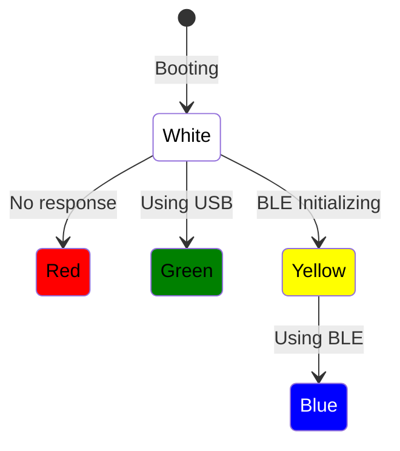
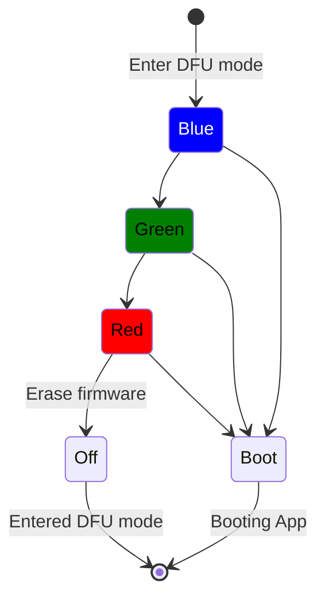

# ESTKme-RED Diagram

## Uncontrolled RGB LED State Diagram

### General

### DFU Mode

Short C1 and C3 pins to enter ESTKme-RED reader DFU mode

see [Smartcard Pinout](https://en.wikipedia.org/wiki/Smart_card#/media/File:SmartCardPinout.svg) definiton

